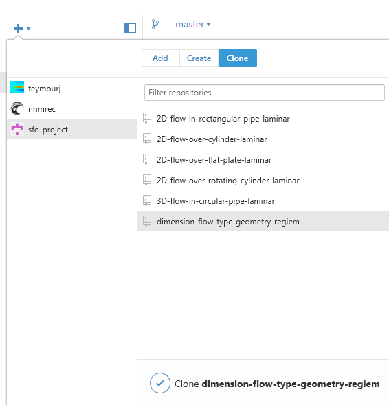
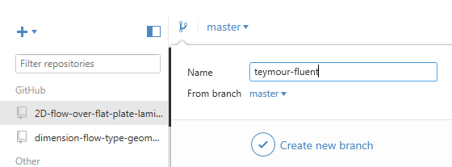
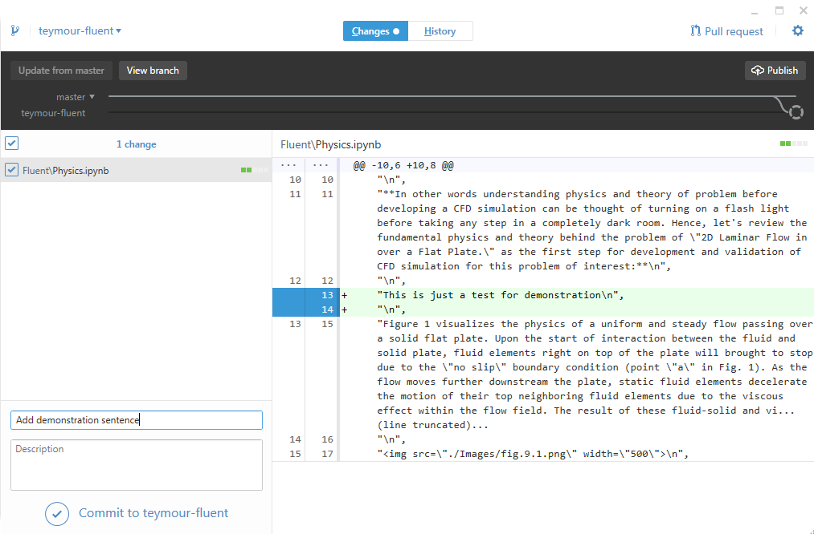
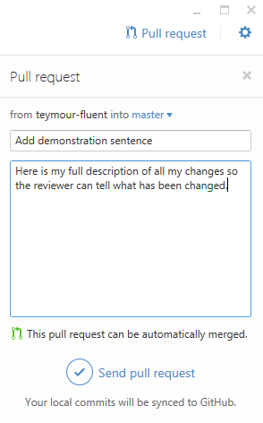

# Template for a repository in SFO Project

[](http://sfo-project-slack.herokuapp.com)

Please make sure to install the requirements first:
- [Github Desktop](https://desktop.github.com/) - Windows/OSX only
- [Python](https://www.python.org/downloads/) - Make sure to check `Add python to PATH` option during the installation process.

## Clone the repository
Once you open `Github Desktop` app & login to your user account, click on the plus sign in left top corner, and select `Clone` tab. You should see `sfo-project` on the right hand side. Once you click on that you can select the repository that you are going to work on and click on `Clone` button and select the default path (See image below). This will download the content to your machine so you can start working on it.



## Virtual Environment
This environment will help us setup `Jupyter` for the project.

### For Windows
Once you install Github Desktop it should add `Github Shell` shortcuts to your desktop. Please use that to do the following commands:
```
# Move to the repository you just cloned with Github Desktop
cd C:\Users\[your-user-name]\Docuements\Github\[the-repository-name]

# Ask python to create the virtual environment
python -m venv venv

# Activate the virtual environment
.\venv\Scripts\Activate.ps1

# You should see (venv) at the beginning of the command line:
# Example: (venv) C:\Temp\
```

### For Linux/OSX
```shell
# Move to the repository you just cloned with Github Desktop
cd ~\Github\[the-repository-name]

# Setup virtual environment via python3
pyvenv venv

# Active the virtual
source venv/bin/activate

# You should see (venv) at the beginning of the command line:
# Example: (venv) $~\Github\[the-repository-name]:
```

## Jupyter
Once you have your virtual environment activated then you can install `Jupyter` packages:

```shell
# Install jupyter python package from requirements file
pip install -r requirements.txt

# Install nbextensions manually
pip install https://github.com/ipython-contrib/IPython-notebook-extensions/archive/master.zip

# Start Jupyter notebook
jupyter notebook
# It should open a web page on your browser on http://localhost:8888/tree
```
To enable extensions such as `spell-checker` go to http://localhost:8888/nbextensions and activate the extensions.

## Github
At this point, you should be able to work on documents through Jupyter in your browsers. Once you are done with that, you need to create a `branch` to `commit` your changes and create a `pull-request`. Don't worry about all those terms. We are going to cover each of those in sections below.

### Branch
Branching will isolate your changes from the original changes. This way we can review your changes against the original content and see what has been changed. In order to create branch, you need to click on the `branch` icon and give it a name (See figure below). According to the software that you are writing your documents, the name of the branch should be `yourname-software`. For example if the name is `Teymour` and he is working on `fluent` documents then the name of the branch will be `teymour-fluent`.
NOTE: Please make sure `From branch` is pre-selected with `master`



### Commit
You can think of `Commit` as a save version of document(s) with short summary about the changes. To commit the changes your made you can select `Changes` tab on top of the `Github Desktop`. Once you click it, you should see the changes that made for each individual file (Don't worry about weird formatting. Those changes are made by Jupyter). For each file that you want to commit select the checkbox next to it, and fill out the `Summary` section (Please keep it short). Now you can commit it by clicking on `Commit to [your-branch-name]`. Here is an example




### Pull Request
Your changes are committed to your branch and ready to be sent to use by creating the `pull-request`. You can do this by clicking on `pull-request` on top right corner. This should bring up the small section in right hand side where you can add a `Title` and `Description`. The `Description` is the best place to describe your changes in details, and if you have any concern about those changes you can explain it there. Once you are done you can click `Send pull request`. This will send it to Github for us to review.



You made it up to here. Yay! that means you have contributed to SFO-Project and we appreciate your contribution. Once your `pull-request` is approved your commits will make it to `master` branch under your name.

Thanks and happy SFOing :)
